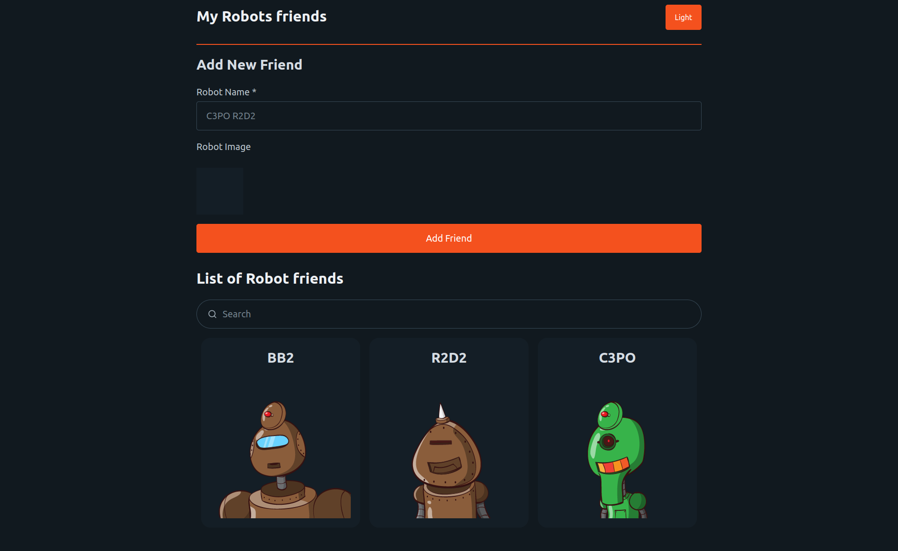
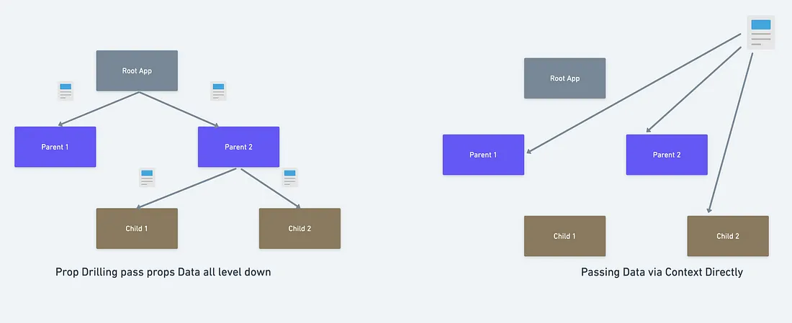
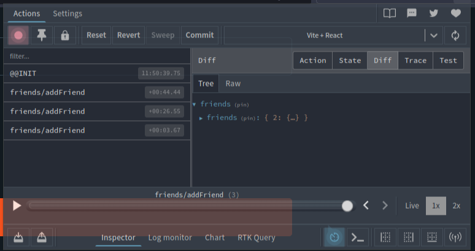

# React Context And Redux

Most of the time, you will have a state that needs to be accessible from different parts on our application.

**Example**

Lets create a simple robots friends app

1. A user can type in a robot name
2. We use https://robohash.org/ to get a robot image
3. We preview the robot image
4. User can click `Add Friend` to add the robot to the list of friends
5. Friend list will display all the friends added
6. The Firends list will also have an input to search for a friend



To Create This App we created to separate components

1. `List` - This component will display the list of friends
2. `Form` - This component will display the form to add a friend
3. `App` - This component will be the parent component that will hold the state and pass it down to the other components

**App.js**


Using this method we can create a simple app that will work as expected. But as our apps get bigger and more complex, we will need to pass the state down to many components and this can get messy.

This phenomenon is called **Prop Drilling**. We will have to pass the state down to many components that don't need it.




## How can we solve this problem?

We basically need a global state that can be accessed from any component, today we will see two ways to do this.

`React Context` : This is shipped with react and is the simplest way to create a global state, for most of the cases this will be enough.

`Redux` : This is a library that will help us manage our global state, it is more complex than `React Context` but it is more powerful and flexible.

## Solving with React Context

1. Create a context

```jsx
import React from 'react';

const AppContext = React.createContext();

export default AppContext;
```

2. Wrap the components that need access to the state with the `Provider`

```jsx
import React from 'react';
import AppContext from './AppContext';

const App = () => {
  const [friends, setFriends] = React.useState([]);

  function addFriend(friend) {
    setFriends([...friends, friend]);
  }

  return (
    <AppContext.Provider value={{ friends, setFriends, search, setSearch }}>
      <Form />
      <List />
    </AppContext.Provider>
  );
};

export default App;
```

3. Access the state from the components

```jsx

import React from 'react';

import AppContext from './AppContext';

const List = () => {
  const { friends } = React.useContext(AppContext);

  return (
    <div>
      {friends.map((friend) => {
        // do our thing
      })}
    </div>
  );
};

export default List;
```

As you can see:

* Anything exposed by the `Provider` can be accessed from the components using the `useContext` hook.
* Component does not have to be immediate children of the `Provider` to access the state, they can be nested as deep as you want.
* The state from `useContext` is reactive, meaning that if the state changes, the component will re-render.


## Solving with Redux

Redux is for the state heavy applications, it is very powerful and flexible but it is also more complex, so complex that libraries and helpers were created to make it easier to use.

We will be using [Redux Toolkit](https://redux-toolkit.js.org/introduction/getting-started) to create our global state.

1. Install the dependenciesUseSelector
```bash
pnpm install @reduxjs/toolkit react-redux
```

2. Create a slice: A slice is a piece of state that will be managed by redux

```jsx
import { createSlice } from '@reduxjs/toolkit';

// this is the initial state
const initialState = {
  friends: [],
};

// createSlice will create the slice for us
const friendsSlice = createSlice({
    // this is the name of the slice
    // this will be used to access the state
    // from the components
  name: 'friends',
  // this is the initial state
  initialState,
  // reducers are functions that will modify the state
  // they are the only way to modify the state
  // reducers can't be async functions
  // reducers can only be called by dispatching an action
  reducers: {
    addFriend(state, action) {
      state.friends.push(action.payload);
    },
  },
});

// we export the reducer
// this will be used to create the store
export default friendsSlice.reducer;

// we export the actions
// this will be used to dispatch the actions
export const { addFriend } = friendsSlice.actions;
```

3. Import the friends reducer and create the store

```jsx
import { configureStore } from '@reduxjs/toolkit';

import friendsReducer from './friendsSlice';

const store = configureStore({
  reducer: {
    friendsState: friendsReducer,
  },
});

export default store;
```

4. Wrap the components that need access to the state with the `Provider`

```jsx
import React from 'react';
import { Provider } from 'react-redux';

import store from './store';

const App = () => {
  return (
    <Provider store={store}>
      <Form />
      <List />
    </Provider>
  );
};

export default App;
```

5. Access the state from the components

```jsx
import React from 'react';

import { useSelector } from 'react-redux';

const List = () => {
    // this is used to select the store/slice we want to access/work with
  const friends = useSelector((state) => state.friendsState.friends);

  return (
    <div>
      {friends.map((friend) => {
        // do our thing
      })}
    </div>
  );
};

export default List;
```

6. Update the state from the components

```jsx
import React from 'react';

import { useDispatch } from 'react-redux';

import { addFriend } from './friendsSlice';

const Form = () => {
  const dispatch = useDispatch();

  const [name, setName] = React.useState('');

  function handleSubmit(e) {
    e.preventDefault();
    // dispatch the action
    dispatch(addFriend(name));
    setName('');
  }

  return (
    <form onSubmit={handleSubmit}>
      <input
        type="text"
        value={name}
        onChange={(e) => setName(e.target.value)}
      />
      <button type="submit">Add Friend</button>
    </form>
  );
};

export default Form;
```

## Redux DevTools

Redux DevTools is a browser extension that will help us debug our redux state.

To install it, go to your browser extension store and search for `Redux DevTools` and install it.



Redux DevTools will allow us to see the state of our application and also allow us to time travel, meaning that we can go back in time and see the state of our application at a specific time.


## Extra 

* Add a delete button to the list of friends, in all the examples no global state/context/redux.